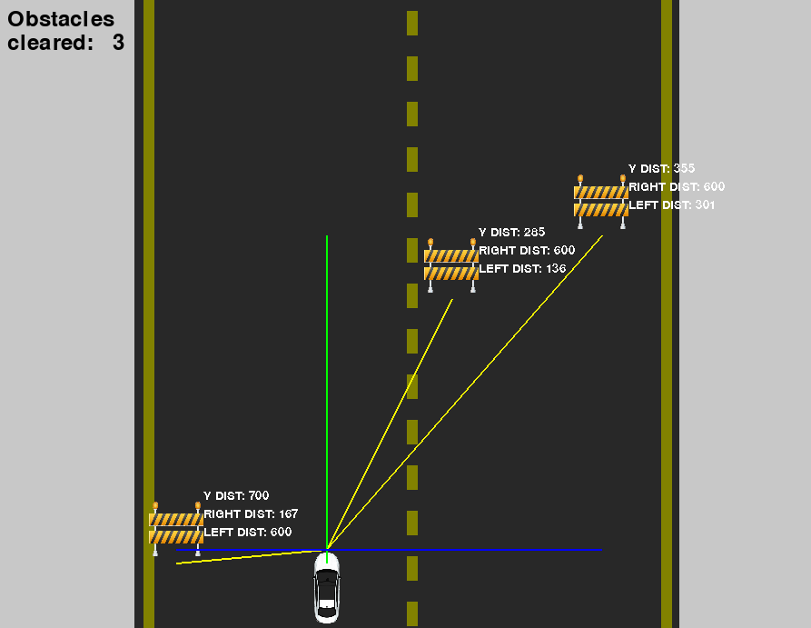

# Fuzzy Car Simulator

Welcome to the Fuzzy Car Simulator! This project simulates a car controlled by fuzzy logic, navigating through obstacles in a pygame environment.

## In this readme: 

0. [State](#state)
1. [The project](#the-project)
2. [Basic Design](#basic-design)
3. [Installation](#installation)
4. [Usage](#usage)
5. [TODO's](#todos)
6. [License](#license) 
7. [References](#references)
   
<a name="headers"/>

## State
</a>

> Still in development! For now, this is a functioning prototype. Fuzzy rules are still being adjusted, so the car doesn't respond as well as it should.

<a name="headers"/>

## The project

</a>

The Fuzzy Car Simulator is a Python-based project that uses fuzzy logic to control a car's movement. The car navigates through a simulated environment, avoiding obstacles and responding to sensor inputs. The project leverages the `pygame` library for the simulation and `scikit-fuzzy` for fuzzy logic control.


</img>

<a name="headers"/>

## Basic Design

</a>

The project is structured into several modules. Here is a basic explanation, and below some diagrams to illustrate the structure (which is not as hard as to need diagrams but oh well this is a class project, beware i'm not a Sof. Eng.):

- **main.py**: The entry point of the simulation. It initializes the game environment and runs the simulation loop.
- **entornoEntidades**: Contains the entities and environment classes, including the car (`Coche`) and constants (`Constants`).
- **monitor.py**: Handles the display and drawing functions, including sensors and game text.
- **fuzzyControl.py**: Implements the fuzzy logic control using `scikit-fuzzy`.
- **sensores.py**: Sensors implemented by the Car class.


</img>


<a name="headers"/>

## Installation

</a>

To run the Fuzzy Car Simulator, you need to have Python installed on your system. Follow these steps to set up the project:

1. **Clone the repository**:
    ```sh
    git clone https://github.com/usbt0p/fuzzy_car.git
    cd fuzzy_car
    ```

2. **Install the required dependencies on a virtual environment**:
    You should create a virtual environment to install the dependencies. This is good practice to avoid conflicts with other projects:
    ```sh	
    python -m venv venv
    source venv/bin/activate
    ```
    And then just install them:
    ```sh
    pip install -r requirements.txt
    ```
<a name="headers"/>

## Usage

</a>

For correct usage now the user should add the project directory to
the environment variable `PYTHONPATH` so that Python knows where
to search for the executable files.

One way of doing it is this, do the following after downoading
the project:
- Go, through command line, to the root directory in which the project
was downloaded in your PC.
For example if you downloaded it to ``C:\user\documents``, go to
``C:\user\documents\fuzzy_car``.

    ```sh
    cd <your_path>/fuzzy_car
    ```

- Once there, you must add the path to the environment variable.

On Windows, type the followng command: `$env:PYTHONPATH = '.'`

On Linux, type: `export PYTHONPATH=.`

Of course, the same would work if ``'.'`` is substituted with the absolute
path of the directory.

To start the simulation, run the `main.py` file:

```sh
python main.py
```
<a name="headers"/>

## TODO's

</a>

> This section acts as a kind of 'mind dump'. Ideas I may want to include or to study, etc. None of them are mandatory, it's just a guideline.

### Main functionalities / functional requirements
- [ ] Adjust spawn rate of obstacles and prevent impossible spawns and blockages:
    - [x] no obstacle overlap
    - [ ] no "barriers": spawns in line that don't leave room for the car to fit between them
- [ ] Adjust controller: too many obstacles on one side overpower one very close on the other
- [ ] Adjust defuzz method an possibly some membership functions (change to trapezoidal, move fuzzy numbers)
- [ ] Write unit tests 
- [ ] mirar researchgate para cosas de funciones de pertenencia y de defuzz
- [ ] make a 'obstacle circuit' where the car makes a turn +  barrier mode that spawns barriers with a hole so the car goes into it
- [x] check what happens if an obstacle is right in front, and neither
    `self.front_x_coords > obstacle.front_x_coords` nor `self.front_x_coords < obstacle.front_x_coords` are true `(d_x, d_y) == (None, None)`.
- [ ] fix: car still overreacts when obstacle is far away to the side

### Optional requirements / GUI stuff
- [x] Draw hitboxes to debug possible problems 
- [x] Fix bad road drawing when resizing window 
- [ ] Make car change angle when turning
- [ ] Make road lines move for a more dynamic environment
- [ ] Randomize obstacle images
- [ ] modificar las constantes de dimensión para que dependan del obstáculo, si no randomizarlos es imosible
- [ ] do some typing for the modules
- [ ] add an argsparser, and take spawn methods as arguments, as well as options for hitboxes, showing sensor views and activating collisions

### Documentation
- [x] Update documentation with latest changes
- [x] Add image to readme
- [ ] Document problems: 
    - rules are hard to tame: separated right from left, order matters
    - more variables than initially expected (return to center, etc.)
    - choosing the right membership functions depends on the desired behavior
    - choosing the rules is a bit of a trial and error process, and changes with the MFs
    - fix moving too soon and moving when not needed (dist_x big or dist_y big)
    - sometimes, less rules is better. To remove the issue where the car over reacted at
    long distances, I simply removed rule 7: ``(distance_side['high'] -> steering['no'])``
    - bug in the sensors: i stopped the y_coords after the front was passed, it
caused the car to crash from behind upon passing

### Ideas
- Several controllers finetuned to specific scenarios. For example one for close and dense vehicle situations, and another one for few vehicles in a long range (avoids preventively).
- Following this idea, wo could have:
    - A controller with few and smooth rules that operate for long distances, since far away cases don't need as much precision.
    - A controller for more close situations (determined by the number of obstacles and their proximity maybe), that would have more rules but would deactivate as soon as the obstacles leave the range.
- Having the 'higher' parameter only for the most critical rule ensures it will always overpower others even in many vehicle scenarios.
- Some optimization is needed for the code to work properly. A profiling tool would be useful.
- It could be smart to make the sensors have a 'radius' that only returns the k nearest obstacle's data.
- Introducing random noise could be an interesting way of checking other benefits of the fuzzy controller.

<a name="headers"/>

## License

</a>

This project is licensed under the MIT License. See the [LICENSE.txt](LICENSE.txt) file for details.

Enjoy the simulation and happy coding!

<a name="headers"/>

## References

</a>

[Cool markdown guide for readme's](https://github.com/adam-p/markdown-here/wiki/Markdown-Here-Cheatsheet#code) plus [creating markdown table of contents](https://stackoverflow.com/a/18244520).

Things I learned while doing this project:
- [Circular imports](https://rollbar.com/blog/how-to-fix-circular-import-in-python/#) are a problem in Python. Didn't come across them until now. Makes sense given how it does module search an bytecode compilation.
- Git things like [removing tracked files](https://stackoverflow.com/questions/45400361/why-is-gitignore-not-ignoring-my-files) and [gitignore exclusions from wildcards](https://stackoverflow.com/questions/5533050/gitignore-exclude-folder-but-include-specific-subfolder).

- Fuzzy rules, as simple as they may seem, have some issues. 

    First, there can be a huge combinatorial explosion of rules that have to be defined if one chooses several antecedents and consequents, moreso if each one has a high amount of membership functions.

    Then there is the issue of testing and debugging. Since the only way to check if the rules are correct in *any scenario* is by trial and error + gradual improvement, testing and adjusting takes a lot of time.


