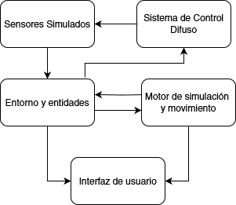
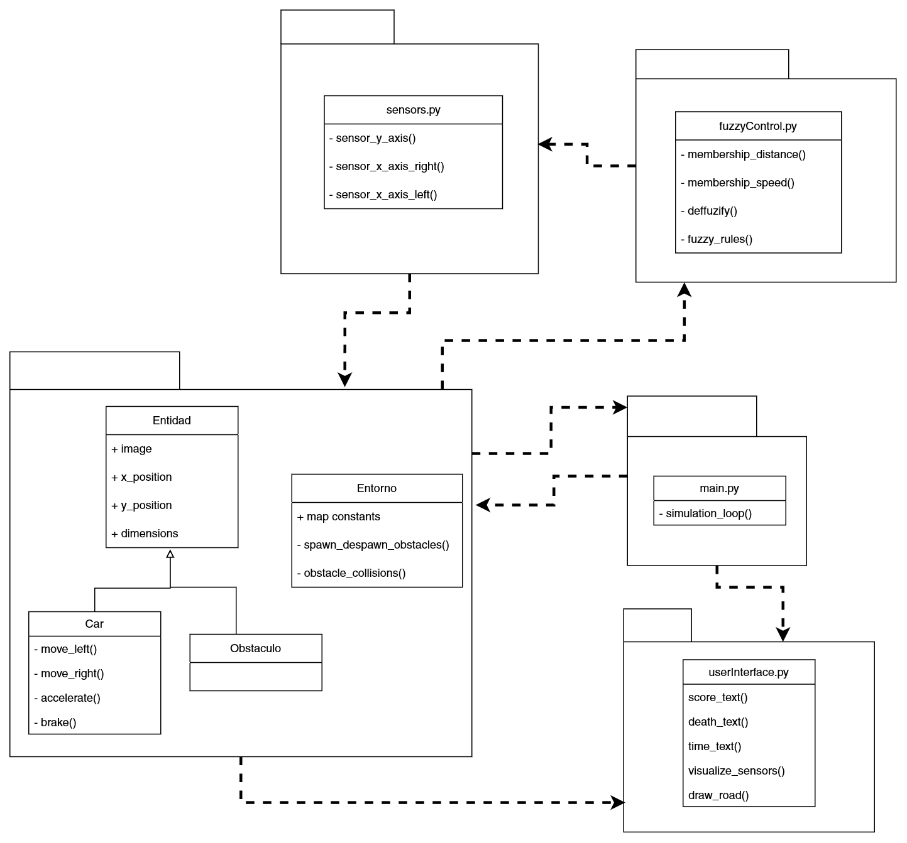

# Fuzzy Car Simulator

Welcome to the Fuzzy Car Simulator! This project simulates a car controlled by fuzzy logic, navigating through obstacles in a pygame environment.

## In this readme: 

0. [State](#state)
1. [The project](#the-project)
2. [Basic Design](#basic-design)
3. [Installation](#installation)
4. [Usage](#usage)
5. [License](#license) 
6. [References](#references)
   
<a name="headers"/>

## State
</a>

> Still in development!!! Basic structure is done, fuzzy control on the way.

<a name="headers"/>

## The project

</a>

The Fuzzy Car Simulator is a Python-based project that uses fuzzy logic to control a car's movement. The car navigates through a simulated environment, avoiding obstacles and responding to sensor inputs. The project leverages the `pygame` library for the simulation and `scikit-fuzzy` for fuzzy logic control.

<a name="headers"/>

## Basic Design

</a>

The project is structured into several modules. Here is a basic explanation, and below some diagrams to illustrate the structure (which is not as hard as to need diagrams but oh well this is a class project, beware i'm not a Sof. Eng.):

- **main.py**: The entry point of the simulation. It initializes the game environment and runs the simulation loop.
- **entornoEntidades**: Contains the entities and environment classes, including the car (`Coche`) and constants (`Constants`).
- **monitor.py**: Handles the display and drawing functions, including sensors and game text.
- **fuzzyControl.py**: Implements the fuzzy logic control using `scikit-fuzzy`.
- **sensores.py**: Sensors implemented by the Car class.





</img>


<a name="headers"/>

## Installation

</a>

To run the Fuzzy Car Simulator, you need to have Python installed on your system. Follow these steps to set up the project:

1. **Clone the repository**:
    ```sh
    git clone https://github.com/usbt0p/fuzzy_car.git
    cd fuzzy_car
    ```

2. **Install the required dependencies on a virtual environment**:
    You should create a virtual environment to install the dependencies. This is good practice to avoid conflicts with other projects:
    ```sh	
    python -m venv venv
    source venv/bin/activate
    ```
    And then just install them:
    ```sh
    pip install -r requirements.txt
    ```
<a name="headers"/>

## Usage

</a>

For correct usage now the user should add the project directory to
the environment variable `PYTHONPATH` so that Python knows where
to search for the executable files.

One way of doing it is this, do the following after downoading
the project:
- Go, through command line, to the root directory in which the project
was downloaded in your PC.
For example if you downloaded it to ``C:\user\documents``, go to
``C:\user\documents\fuzzy_car``.

    ```sh
    cd <your_path>/fuzzy_car
    ```

- Once there, you must add the path to the environment variable.

On Windows, type the followng command: `$env:PYTHONPATH = '.'`

On Linux, type: `export PYTHONPATH=.`

Of course, the same would work if ``'.'`` is substituted with the absolute
path of the directory.

To start the simulation, run the `main.py` file:

```sh
python main.py
```
<a name="headers"/>

## License

</a>

This project is licensed under the MIT License. See the [LICENSE.txt](LICENSE.txt) file for details.

Enjoy the simulation and happy coding!

<a name="headers"/>

## References

</a>

[Cool markdown guide for readme's](https://github.com/adam-p/markdown-here/wiki/Markdown-Here-Cheatsheet#code) plus [creating markdown table of contents](https://stackoverflow.com/a/18244520).

Things I learned while doing this project:
- [Circular imports](https://rollbar.com/blog/how-to-fix-circular-import-in-python/#) are a problem in Python. Didn't come across them until now. Makes sense given how it does module search an bytecode compilation.
- Git things like [removing tracked files](https://stackoverflow.com/questions/45400361/why-is-gitignore-not-ignoring-my-files) and [gitignore exclusions from wildcards](https://stackoverflow.com/questions/5533050/gitignore-exclude-folder-but-include-specific-subfolder).


